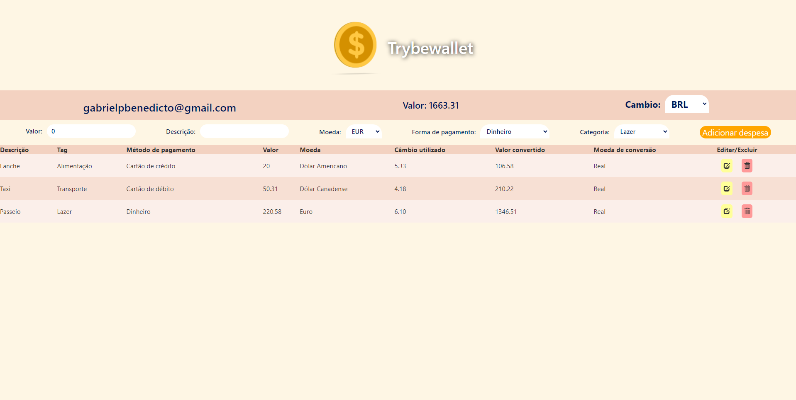

## Projeto de Trybewallet

### Sobre o projeto:

O projeto é um site de cambio, utilizando uma API que informa os valores do cambio para Real, sendo possivel anotar os gastos em diversas moedas, e o valor é convertido para Real Brasileiro, ficando salvo em seu navegador e utilizando o cambio no momento atual que realizou a adição.

### Demonstração

### Técnologias usadas:

Front-end:

>Desenvolvido usando: HTML5, CSS3, JavaScript com ES6, React, Redux;

### Instalando Dependências

Front-End:

>npm install

### Executando aplicação

Para rodar o site é preciso abrir um terminal e instalar as dependências, executando o npm install na pasta inicial do projeto, após instalar as dependências.

Utilize o comando:

>npm start

Ele abrirá a página inicial de identificação, coloque seu nome e e-mail e aproveite o/
